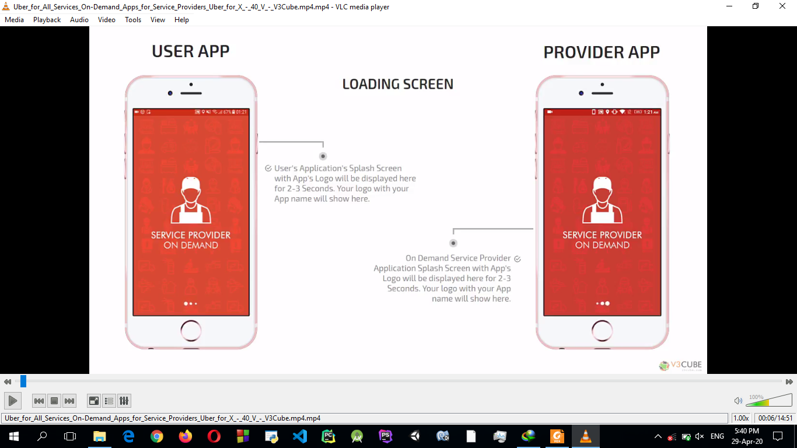

# Menged
Menged is path telling app that show taxi and bus path to path finders.

## Installation
``` bash
pip install django
```
## usage
``` python
import foo bar
def helloWord():
    return hello world

```
## screen shoots

## Contributing
Pull requests are welcome. For major changes, please open an issue first to discuss what you would like to chang.

Please make sure to update tests as appropriate.

## Licence
[MIT](https://choosealicense.com/licenses/mit/)